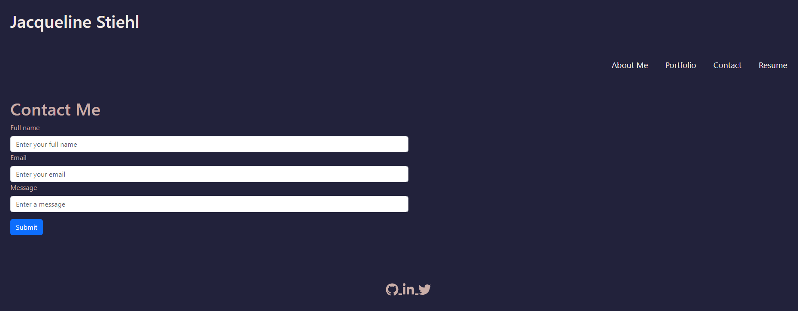

# React Portfolio

## Description/What I attempted to do

Create a portfolio using React to share my projects as I apply for jobs and work with other developers.

## Table of Contents

### [Usage](#usage)

### [License](#license)

### [Contributing](#contributing)

### [Questions](#questions)

## Usage

The user can view the web developer portfolio with sections for About Me, Portfolio, Contact and Resume. Users can navigate through the sections to learn more about the developer, view the developer's project portfolio, fill out a form to contact the developer, and view the developer's resume.

## License

The license for this project is MIT and the link for license information is https://opensource.org/licenses/MIT.

## Contributing/Acknowledgements

Tips from University of Minnesota Full Stack Bootcamp instructor Gary Almes and notes from class sessions.

Tips from class TA Katy Vincent.

Tips from tutoring session with Alexis San Javier through University of Minnesota coding boot camp.

Tips from the following websites:

- https://stackoverflow.com/questions/73004871/how-can-i-proper-set-link-to-react-icon-using-react-styled-components
- https://react-icons.github.io/react-icons

## Questions

Please find more information at my GitHub, located [here](https://github.com/Jacqueline-Stiehl).
If you have additional questions, please contact me at salsajackie@yahoo.com.

## Screen shot

## Link to the working version of the code

https://github.com/Jacqueline-Stiehl/react-portfolio-stiehl

## URL of deployed application

https://jacqueline-stiehl.github.io/react-portfolio-stiehl/

## URL of application deployed on Netlify

https://master--steady-longma-5bb57a.netlify.app/home
